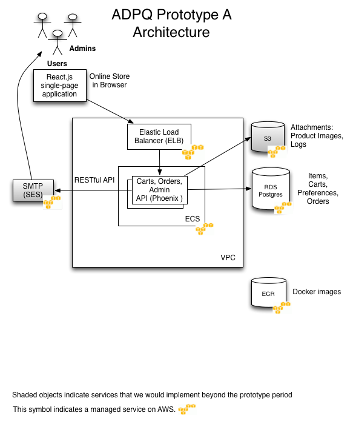

# Prototype A URL
https://adpq.labzero.com/

**Administration Login**
* User: admin
* Pass: admin

**Requester Login**
* User: user
* Pass: user

**_Notes:_** 

1. You can create additional Requester accounts by logging in with any unique username and the password “user”. This may be helpful for cart & reporting testing.
2. [Quick-access walkthrough](https://github.com/labzero/adpq/blob/develop/RFI-Walkthrough.md) to confirm how Lab Zero's prototype meets the functional requirements stated in Prototype A RFI.

# Table of Contents
* Setup Instructions [Setup Instructions](#setup-instructions)
* Technical Approach
* Playbook Adherence
* Requirements List

# Setup Instructions

## Installation of requirements

### Software Versions

  * Elixir 1.4.1 (Erlang/OTP 19 [erts-8.2])
  * Phoenix Framework 1.2.1
  * postgres (PostgreSQL) 9.6.2
  * Node.js 7.5.0
  * React 15.4.2

### MacOS dev environment
  1. Install Homebrew if not already installed `/usr/bin/ruby -e "$(curl -fsSL https://raw.githubusercontent.com/Homebrew/install/master/install)"`
  1. Update Homebrew `brew update`
  1. Install postgresql `brew install postgresql`
  1. Install node `brew install node`
  1. Install elixir `brew install elixir`
  1. Install mix `mix local.hex`
  1. Create PostgreSQL role `createuser -d adpq`
  1. Create and migrate schema `mix ecto.create && mix ecto.migrate`
  1. To add seed data to your database: `mix run priv/repo/seeds.exs`

## Starting the application

  1. Install dependencies with `mix deps.get`
  1. Install Node.js dependencies with `npm install`
  1. Start Phoenix endpoint with `mix phoenix.server`

Now you can visit [`localhost:4000`](http://localhost:4000) from your browser.

# Technical Approach

## Introduction
The Lab Zero team’s approach to product development and software delivery is very close to the steps outlined in the U.S. Digital Services Playbook and fully illustrated within the [Docs folder](https://github.com/labzero/adpq/tree/develop/docs) and the Playbook Adherence section below. In the abbreviated timeline for this assessment, our team engaged with target users to gain a deeper understanding of their needs and to test solution ideas. User feedback is quickly incorporated into our work through prioritized user stories, which are addressed by members of the team during a sprint. Collaboration between roles let the team choose best-of-breed designs that could be feasibly delivered within the timeline. Our engineers chose modern tools that supported our need to bring features together quickly and deliver them continually through the timeline with a high degree of quality. The team’s high level of rigor in engineering—gleaned from years of experience delivering mission-critical applications—results in code that’s easy to adapt to meet evolving business needs. 

## Architectural Approach
This web application consists of a modern React.js app (Single Page Application) that consumes a JSON API backend written in Elixir using the Phoenix framework backed by a Postgres database. We considered using Shopify or Spree but ultimately decided to build the prototype from scratch. This decision enabled us to demonstrate our ability to develop an easy-to-use application designed in light of careful and deliberate conversations with real users.

## Development Process
We use the GitFlow branching model and create feature branches off of the develop branch for all new changes. All 
commits should adhere to the guidelines described in our [commit guide](https://github.com/labzero/guides/blob/master/process/commit_guide.md). 
Each feature branch is pushed to Github and a pull request is created, built and tested in CircleCI before peer-review 
is performed by other developers on the team. Upon final approval by the dev lead, the branch will be squash-merged back 
into develop.

## CI Process
The CI service checks all Pull Requests and looks for success for all of these steps:
* Compilation and Docker container build
* Credo (code quality/style analyzer)
* Unit tests
* eslint on javascript

## Continuous Delivery
The delivery process relies upon automated movement of code and assets into the test environment triggered by commits to the develop branch. 
* Commits to develop trigger deployment to our Test environment
* Upon deployment, post-deploy automated testing it performed

## Release Process
Using GitFlow tooling, we create a release branch and tag. The tag is then used to create a new container image. A job in CircleCI is used to deploy the tagged container to ECS in AWS.

## Infrastructure Approach
We built the application in a cloud-first manner on AWS, but deployed it in a Docker container in order to allow cloud portability. However, if AWS offers a managed service for something we need, we prefer the managed service to rolling our own infrastructure, i.e. Postgres via RDS instead of running our own Postgres servers in EC2. 

We maintain our VPC and security blueprints as CloudFormation templates checked into Git.
 

# Playbook Adherence

Our prioritized [Prototype Design](https://github.com/labzero/adpq/projects/2) and [Prototype Dev](https://github.com/labzero/adpq/projects/1) backlogs within GitHub show the activities in our iterative and collaborative process from discovery to delivery and deployment. You may also find reference to the Playbook activity within many cards in the Product Design backlog (noted as “PB”).

The list below associates key activities and artifacts with the Digital Service Plays:

## 1: Understand what people need
* Drafted open-ended discovery interview scripts for key personas [Requester Interview Script](https://github.com/labzero/adpq/blob/develop/docs/03-UserInterviews/00-TemplateOpen-endedInterviewScriptforRequester.pdf), [Admin Interview Script](https://github.com/labzero/adpq/blob/develop/docs/03-UserInterviews/00-TemplateOpen-endedInterviewScriptforAdmin.pdf)
* Interviewed representative users, learnings shared and informed project goals and designs [Dennis Baker](https://github.com/labzero/adpq/blob/develop/docs/03-UserInterviews/01-Interview1.1DennisBaker-StateAssemblyReprographicsManager.pdf), [Robert Lee](https://github.com/labzero/adpq/blob/develop/docs/03-UserInterviews/02-Interview2.1RobertLee-StartupOfficeManager.pdf), [Ned Holets](https://github.com/labzero/adpq/blob/develop/docs/03-UserInterviews/04-Interview3.1NedHolets-CMSDeveloper.pdf)
* Utilize existing large scale quantitative eCommerce research through the Baymard Institute [Ecommerce Usability Guidelines](https://github.com/labzero/adpq/blob/develop/docs/02-Research/01-RelevanteCommerceUsabilityGuidelines.pdf), [Shopping & Procurement Research](https://github.com/labzero/adpq/blob/develop/docs/02-Research/02-ShoppingandProcurementResearch.pdf) 
* Outline Full Persona List to note all roles likely involved in the full experience [Link](https://github.com/labzero/adpq/blob/develop/docs/04-UserPersonas/00-FullPersonasList.pdf)
* Focus on and define State Agency Requester as primary persona [Link](https://github.com/labzero/adpq/blob/develop/docs/04-UserPersonas/01-StateAgencyRequesterPersona.pdf)
* Focus on and define Lead Purchasing Org web admin as secondary persona [Link](https://github.com/labzero/adpq/blob/develop/docs/04-UserPersonas/02-DataAdminPersona.pdf)
* Capture & prioritize needs as user stories [Link](https://github.com/labzero/adpq/projects/1)
* Regularly test to validate problem/solution fit [Robert Lee](https://github.com/labzero/adpq/blob/develop/docs/03-UserInterviews/03-Interview2.2RobertLeeConceptTest.pdf), [Tracey Thompson](https://github.com/labzero/adpq/blob/develop/docs/09-UserTesting/03-Interview4.1TraceyThompsonUsabilityTest.pdf)

## 2: Address the whole experience, from start to finish
* Illustrated on- & off-line touch points and align team on key points of impact & focus [Service Map](https://github.com/labzero/adpq/blob/develop/docs/05-JourneyMapping/01-ServiceMap.png)
* Stated project summary, goals, & metrics to ensure the effort meets needs [Product Speclet](https://github.com/labzero/adpq/blob/develop/docs/01-ProductStrategy/03-ProductSpeclet.pdf)

## 3: Make it simple and intuitive
* Consistently utilized US Web Design Standards
* Followed accessibility best practices Section G of Requirements List
* Leveraged login to provide users with a way to exit and return later to complete process
* Improved readability by re-formatting and adjusting sample data [Data Spreadsheet](https://github.com/labzero/adpq/blob/develop/docs/01-ProductStrategy/01-CAVPData.pdf)

## 4: Build the service using agile and iterative practices
* Shipped a functioning MVP
* Frequently ran usability tests to identify improvements [Interviews](https://github.com/labzero/adpq/tree/develop/docs/03-UserInterviews), [User Testing](https://github.com/labzero/adpq/tree/develop/docs/09-UserTesting)
* Facilitated team alignment & communication through daily standups, [weekly demos/retros](https://github.com/labzero/adpq/tree/develop/docs/10-RetrospectiveNotes), & [Slack channel](https://github.com/labzero/adpq/blob/develop/docs/01-ProductStrategy/05-CollaborationWorkSample-SlackConversation.jpeg)
* Kept the delivery team flat & focused [Kickoff deck](https://github.com/labzero/adpq/blob/develop/docs/01-ProductStrategy/00-KickoffDeck.pdf)
* Drafted a prioritized features backlog and review with team [Link](https://github.com/labzero/adpq/projects/1)

## 6: Assign on leader and hold that person accountable
* See Requirements List, Section A

## 7: Bring in experienced teams
* See Requirements List, Section B

## 8: Choose a modern technology stack
* See Requirements List, Section L

## 9: Deploy in a flexible hosting environment
* See Requirements List, Section M

## 10: Automate testing and deployments
* See Requirements List, Section O

## 12: User data to drive 
* See Requirements List, Section Q

## 13: Default to open
* Utilized open source 

# Requirements List

**a. Assigned one (1) leader and gave that person authority and responsibility and held that person accountable for the quality of the prototype submitted**
> Aaron Cripps, Product Owner

**b. Assembled a multidisciplinary and collaborative team that includes, at a minimum, five (5) of the labor categories as identified in Attachment B: PQVP DS-AD Labor Category Descriptions**
> The majority of the team is based in the San Francisco Bay Area. One member is in Tucson AZ, one member in Little Rock AR. Our team collaborates using tools like Slack, Google Hangouts, Screen Hero, GoToMeeting, and Google Docs. 
* Product Manager - Aaron Cripps
* Technical Architect - Sasha Voynow, Matt Wilson
* Interaction Designer - Dean Baker, Clayton Hopkins
* Visual Designer - Jim Ochsenreiter
* Front End Web Developer - Adam Ducker, Jeffrey Carl Faden
* Backend Web Developer - Sasha Voynow
* DevOps Engineer - Brien Wankel, Dave O’Dell

**c. Understood what people needed, by including people in the prototype development and design process**
> Informed by our initial persona attributes, we found three individuals whose job activities aligned with or related to the Lead Purchasing Organization Administration and State Agency IT Requester roles. 
* [Dennis Baker](https://github.com/labzero/adpq/blob/develop/docs/03-UserInterviews/01-Interview1.1DennisBaker-StateAssemblyReprographicsManager.pdf), State of California Assembly Reprographics Manager
* [Robert Lee](https://github.com/labzero/adpq/blob/develop/docs/03-UserInterviews/02-Interview2.1RobertLee-StartupOfficeManager.pdf), Startup Office Manager
* [Ned Holets](https://github.com/labzero/adpq/blob/develop/docs/03-UserInterviews/04-Interview3.1NedHolets-CMSDeveloper.pdf), Lead Software Engineer who has worked on CMS projects

**d. Used at least a minimum of three (3) “user-centric design” techniques and/or tools**
> Human-centered design is a core aspect of our process. We consider each idea to be a hypothesis which should be tested and proven. You can find a richer explanation of our findings [here](https://github.com/labzero/adpq/blob/develop/Design-Process.pdf). Key activity examples below:
* Customer Development
  * Stating and prioritizing learning goals (hypotheses)
  * Open-ended interviews with people who met our target personas to understand their needs and goals
* In-person usability testing to validate solution ideas/hypotheses
  * Clickable prototypes to support usability testing
  * ‘Think aloud’ qualitative user tests of prototype
  * Accessibility testing
* Leveraging existing usability research 
  * Baymard Institute, an ecommerce usability research firm who uses qualitative and quantitative research methods.

**e. Used GitHub to document code commits**
> Yes, we’ve used Github fully for peer-review and as our sole code repository.

**f. Used Swagger to document the RESTful API, and provided a link to the Swagger API**
> Yes, we've implemented Swagger, you can view it [here](http://adpq.labzero.com:88/swagger-ui)

**g. Complied with Section 508 of the Americans with Disabilities Act and WCAG 2.0**
> Yes, we have used HTML and CSS in a manner that complies with the ADA and WCAG 2.0

**h. Created or used a design style guide and/or a pattern library**
* Utilized the US Web Design Standards for user experience, visual design and responsive guidelines and patterns.
* Leveraged the Baymard Institute’s research-based user interaction guidelines for eCommerce product lists, homepages and checkout.

**i. Performed usability tests with people**
> We showed functional prototypes to the following individuals facilitated by a “Think Aloud” qualitative user test.
* [Robert Lee](https://github.com/labzero/adpq/blob/develop/docs/03-UserInterviews/03-Interview2.2RobertLeeConceptTest.pdf)
* [Tracey Thompson](https://github.com/labzero/adpq/blob/develop/docs/09-UserTesting/03-Interview4.1TraceyThompsonUsabilityTest.pdf)

**j. Used an iterative approach, where feedback informed subsequent work or versions of the prototype**
> We began by clarifying the business case and target outcomes without proposing solutions. This sets the stage for each activity to be oriented around learning and empowers each team member to bring their expertise and creativity into the solutions which are iteratively built and tested. Learnings from each activity are fed back into subsequent iterations, cross-functionally.
* Product Owner led goal-oriented kickoff and drafted a first version of the “Speclet” to align and hold the team accountable to high-level key outcomes and measurements. 
* [Explorations](https://github.com/labzero/adpq/tree/develop/docs) improve in fidelity based on our learning needs
* Key learnings from user interviews informed the project summary, goals, and measurements and allowed us to apply improvements to our designs and development.
* Team story time for formal technical review of prioritized backlog. Development feedback assisted in clarifying prototype behavior and story decomposition.
* Validated design concepts through prototypes with people outside the team. User feedback informed design and development work. 
* Daily sharing  design, development, and product ideas through informal conversations and standups.
* Utilized Scrum framework for frequent inspection and adaptation
  * Product Owner managed a prioritized backlog of tasks for [Design](https://github.com/labzero/adpq/projects/2) & [Development](https://github.com/labzero/adpq/projects/1)
  * Peers review and accept work
  * Daily standup
  * [Sprints](https://github.com/labzero/adpq/tree/develop/docs/10-RetrospectiveNotes): team performed demos and retrospectives

**k. Created a prototype that works on multiple devices, and presents a responsive design**
> Our prototype has been designed, developed and tested to work on desktop browsers, iOS and Android phones.

**l. Used at least five (5) modern and open-source technologies, regardless of architectural layer (frontend, backend, etc.)**
> We utilized many modern open-source technologies:
* Elixir
* Phoenix Framework 
* Ecto (data layer)
* React.js
* Docker
* SASS
* Javascript/ES6
* REST

**m. Deployed the prototype on an Infrastructure as a Service (IaaS) or Platform as Service (PaaS) provider, and indicated which provider they used**
> Our prototype has been deployed to AWS as a Docker container running in ECS using RDS for it’s datastore. 

**n. Developed automated unit tests for their code**
> The Engineering Team delivered stories with working code and some level of automated testing. All tests are run in the continuous integration loop with each. 
* Javascript we wrote Jest tests (link)
* Elixir we wrote ExUnit tests (link)

**o. Setup or used a continuous integration system to automate the running of tests and continuously deployed their code to their IaaS or PaaS provider**
> Our use of a CI server drives automated tests and our deployment pipeline. All new pull requests are tested. We used CircleCI to automate our CI and CD automation. 

**p. Setup or used configuration management**
> We generate CloudFormation templates and build Docker containers, adhering to a https://12factor.net/ approach.

**q. Setup or used continuous monitoring**
> We setup Honeybadger.io for error reporting and Pingdom for uptime monitoring. 

**r. Deployed their software in an open source container, such as Docker (i.e., utilized operating-system-level virtualization)**
> We build Docker containers in our CI/CD process and deploy them to ECR/ECS in AWS.

**s. Provided sufficient documentation to install and run their prototype on another machine**
> Please see the Setup section in this document or the SETUP.md file in root directory of this repository. All engineers used these steps to set up their development environments. 

**t. Prototype and underlying platforms used to create and run the prototype are openly licensed and free of charge**
> All systems used to create and run the prototype are [open source and free of charge for use](docs/Open%20Source%20Technology%20Audit.xlsx). Our prototype carries an [MIT license](LICENSE.md) as well.
